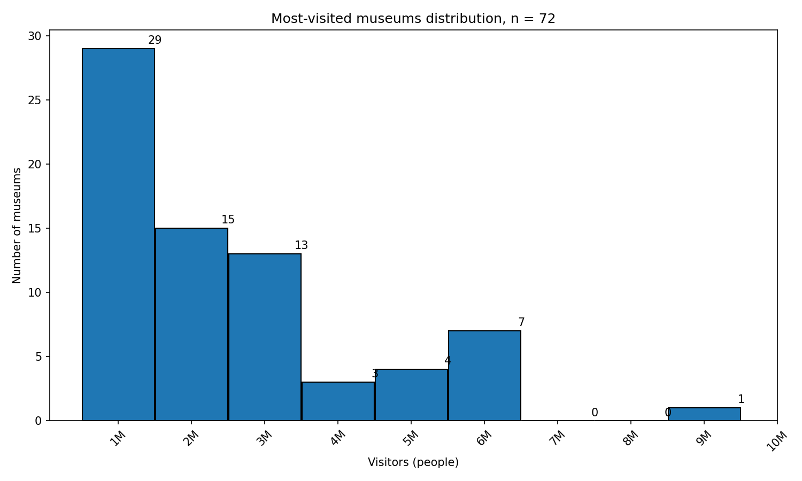

# LUMEN ATLAS 보고서 — 문제 · 데이터 · 그림

배포 주소 : https://world-museum-atlas.vercel.app

## 1. 문제와 대상

- 누가 : 미술관을 비교하려는 운영진과 회원
- 무엇이 어렵나 : 국가와 방문객 수 조건에 맞는 미술관을 목록에서 직접 찾아 비교해야 한다
- 이 서비스가 하는 일 : 국가와 최소 방문객 수를 입력하면 후보를 남기고, AI가 후보 중 한 곳을 이유와 함께 추천한다

## 2. 데이터와 정제

| 항목 | 내용 |
|---|---|
| 출처 | Wikipedia `List of most-visited museums` 목록 |
| 수집 시점 | 2026-09-28 (한국 시간) |
| 행 수 | 원본 72 → 정제 72 · 뺀 행 0 |
| 바꾼 규칙 | 방문객 수의 쉼표·괄호·각주를 제거해 정수형 `visitors`로 변환 · 도시·국가 앞뒤 공백 정리 |
| 원문과 대조 | 표본 3곳 중 3곳 일치 |

## 3. 탐색 — 그림 두 장

### 그림 1. 방문객 수는 어느 구간에 모이나

- 관찰 : 1,000,000 이상 2,000,000 미만 구간이 29개로 가장 많다.
- 대조한 숫자 : 구간 개수 합 29 + 15 + 13 + 3 + 4 + 7 + 0 + 0 + 1 = 72 · 정제 행 수 72와 같다.
- 해석 : 이 표본에서는 방문객 수가 낮은 구간에 더 모이고, 높은 구간으로 갈수록 적어지는 분포일 수 있다.
- 이 자료로 알 수 없는 것 : Wikipedia 목록 1페이지의 72개만 사용했으므로 전체 연도나 전체 미술관 목록의 분포는 알 수 없다.

### 그림 2. 국가별 평균 방문객 수가 다른가

- 관찰 : Vatican 평균이 6,933,822로 가장 높고 Brazil 평균이 1,364,208로 가장 낮다.
- 대조한 숫자 : 국가별 개수 합 72와 정제 행 수 72가 같고, Brazil은 1,364,208 ÷ 1 = 1,364,208으로 손 검산했다.
- 해석 : 이 표본에서는 국가별 평균 방문객 수가 서로 다를 수 있다.
- 이 자료로 알 수 없는 것 : Vatican·Brazil처럼 n=1인 국가가 있어 국가가 방문객 수의 원인이라고 판단할 수 없다.
