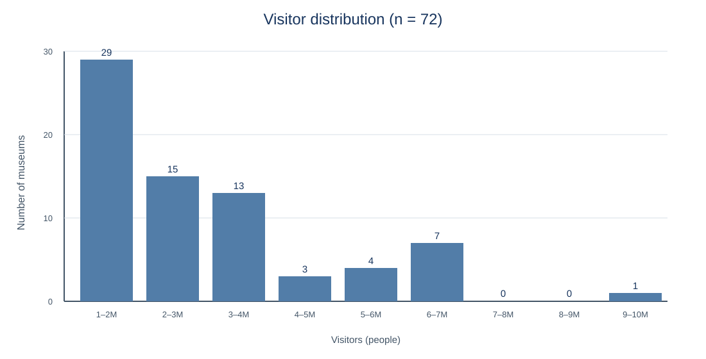
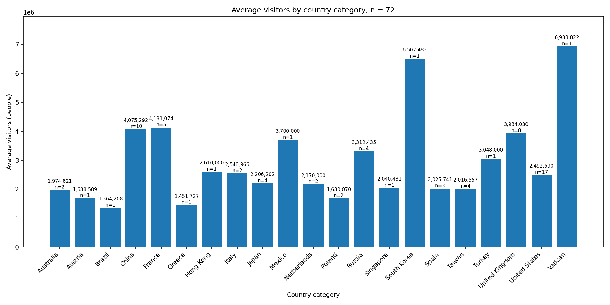

# LUMEN ATLAS 보고서 — 문제 · 데이터 · 그림 · 운영 결과

## 요약
- **무엇을 만들었나** : 방문객 수와 국가를 조건으로 미술관 후보를 좁히고, 후보 안에서 AI 추천을 받는 서비스다.
- **무엇을 확인했나** : 72행 데이터와 정제·차트 수치가 일치했고, `select_item` 이벤트가 GA4 DebugView에 도착했다.
- **남은 것** : Gemini 무료 API 한도 때문에 추천 결과가 항상 표시되는지는 더 관찰해야 한다.

### 대표 그림
**대표 그림 : 5절 추천 화면을 요약 바로 아래로 올림**  
**고른 이유 :** 운영진이 가장 먼저 알고 싶은 건 「무엇을 넣으면 무엇이 나오나」라 그림 1·2보다 이 화면이 한 번에 읽힌다.

배포 주소 : https://world-museum-atlas.vercel.app

## 1. 문제와 대상
- **누가** : 여러 나라의 미술관을 비교하려는 모임 운영진과 회원
- **무엇이 어렵나** : 방문객 수와 국가 조건에 맞는 미술관을 목록에서 직접 찾아 비교해야 한다.
- **서비스가 하는 일** : 조건에 맞는 후보를 보여 주고, 후보 안에서 AI가 한 곳을 골라 근거와 함께 제안한다.

## 2. 데이터와 정제

| 항목 | 내용 |
|---|---|
| 출처 | Wikipedia `List of most-visited museums` 목록 |
| 수집 시점 | 2026-09-28 (한국 시간) |
| 행 수 | 원본 72 → 정제 72 · 빈 행 0 |
| 바꾼 규칙 | 방문객 수의 쉼표와 단위를 제거해 정수 `visitors`로 변환 · 국가명 공백 정리 |
| 원문 대조 | 표본 3곳 중 3곳 일치 |

**다시 모으려면:** 프로젝트 루트에서 `python scripts/03_clean.py` → `python scripts/04_stats.py` → `python scripts/05_hist.py` → `python scripts/06_by_category.py` → `python scripts/07_export_json.py` 순서로 실행한다. `data/clean.csv` 72행, `data/data.json` 72개가 다시 만들어지며 빈값과 중복 URL은 0개다.

## 3. 탐색 — 그림 두 장

### 그림 1. 방문객 수는 어느 구간에 모이나

- 관찰 : 1,000,000 이상 2,000,000 미만 구간이 29곳으로 가장 많다.
- 대조 : 29 + 15 + 13 + 3 + 4 + 7 + 0 + 0 + 1 = 72로 정제 행 수와 같다.
- 해석 : 낮은 방문객 구간에 관측값이 집중되어 있다.
- 한계 : Wikipedia 목록 한 페이지의 72곳만 사용했으므로 전체 미술관 분포로 일반화할 수 없다.

### 그림 2. 국가별 평균 방문객 수

- 관찰 : Vatican 평균 6,933,822명이 가장 높고 Brazil 평균 1,364,208명이 가장 낮다.
- 대조 : 국가별 집계의 표본 수 합계가 72로 정제 행 수와 같다.
- 해석 : 국가별 방문객 규모 차이를 한눈에 비교할 수 있다.
- 한계 : Vatican·Brazil처럼 n=1인 국가는 국가 평균으로 단정하기 어렵다.

## 4. 해결 방식과 AI 적용점

| 구분 | 적용 내용 |
|---|---|
| 코드 | 국가와 최소 방문객 수로 후보를 필터링하고, 후보가 있으면 최대 5개를 AI에 전달한다. 후보가 0개면 AI를 호출하지 않고 안내한다. |
| AI (Gemini) | 후보 이름·방문객 수·국가만 근거로 추천하도록 지시했다. API 키는 코드에 넣지 않고 Vercel 환경변수 `GEMINI_API_KEY`로 관리했다. |
| 사람 | M14에서 추천 이름·숫자·후보 포함 여부를 `data/data.json`과 직접 대조했다. |
| 보내지 않는 것 | 회원 개인정보와 화면에 없는 정보는 프롬프트와 이벤트에 보내지 않는다. |

## 5. 구현 결과

- 동작 : 국가·방문객 수 필터와 후보 카드가 배포 주소에서 동작하고, 후보가 없으면 안내 문장과 비활성 추천 상태를 보여 준다.
- AI 검증 : M14의 정상·후보 1개·후보 없음 세 조건에서 후보 수와 데이터 값은 일치했다.
- 현재 상태 : Gemini 무료 API 사용량 한도에 도달하면 추천 영역에 「사용량 한도에 도달했습니다. 잠시 뒤 다시 눌러 주세요」가 표시된다. 따라서 추천 문장 표시의 지속 성공은 **미완료**다.
- 캡처 자리 : 배포 주소에서 조건 적용 후 후보 카드와 추천 영역이 함께 보이는 화면을 삽입한다.

## 6. 측정과 확인

- 이벤트 : `apply_filter`와 `get_recommendation`은 조건과 추천 상태를, `select_item`은 원래 화면 보기 클릭을 기록하도록 구성했다.
- 도착 확인 : GTM 미리보기에서 `GA4 select_item - 원래 화면 보기` 태그가 실행됐고, GA4 DebugView에서 `select_item` 1회 도착을 확인했다.
- 짝 테스트 : M18에서 짝이 과제 카드를 읽고 조건 적용 → 추천 요청 → 결과 확인 순서로 과제를 끝냈다.
- 한 곳 개선 : M19에서 음수·잘못된 방문객 수 입력을 전용 안내로 처리하고, 정상 조건의 후보 수가 유지되는 것을 확인했다.

## 7. 한계와 다음 단계

- 한계 : Wikipedia 한 페이지의 72개 값이라 최신성·전체 대표성이 보장되지 않는다.
- 한계 : Gemini 무료 API 한도에 따라 추천이 일시적으로 실패할 수 있다.
- 한계 : 짝 1명과 내 재검사 결과만으로 모든 회원의 사용성을 판단할 수 없다.
- 다음 단계 : 배포 후 한 달 동안 `get_recommendation` 성공·한도·오류와 `select_item` 비율을 관찰한다.
- 다음 단계 : 2~3명의 추가 회원에게 같은 과제를 주고, 멈춘 화면과 모바일 차이를 다시 기록한다.

## M21 더 해보기
- 대표 그림 : 5절 추천 화면을 요약 바로 아래로 올림
- 고른 이유 : 운영진이 가장 먼저 알고 싶은 건 「무엇을 넣으면 무엇이 나오나」라 그림 1·2보다 이 화면이 한 번에 읽힌다.
- 쪽 수 : 2쪽 그대로 — 3절 그림 두 장은 둘째 쪽으로 넘어감
